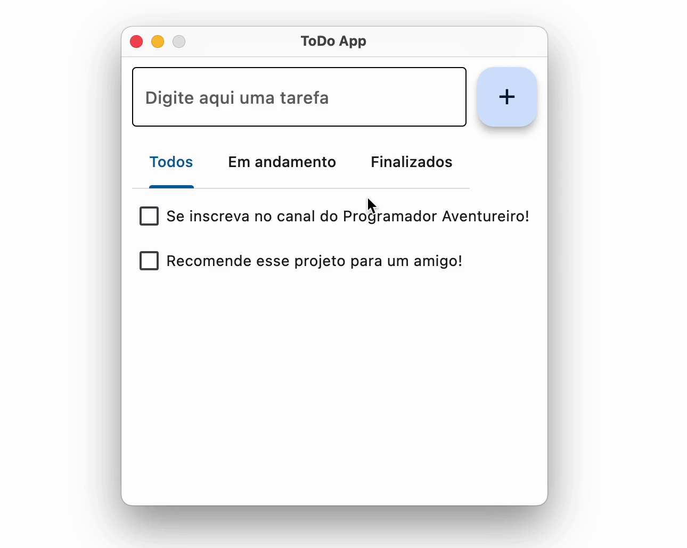

# Gerenciador de Tarefas (ToDo App)


## Descrição do Projeto

O Gerenciador de Tarefas, ou ToDo App, é uma aplicação para criar e gerenciar sua lista de tarefas. Este projeto foi desenvolvido em Python com a biblioteca Flet, proporcionando uma experiência intuitiva e eficiente para organizar suas tarefas diárias. Inclui uso de banco de dados do SQLite3 para manter os dados salvos entre sessões.

## Índice

- [Instalação](#instalação)
- [Uso](#uso)
- [Contato](#contato)

## Instalação

Para executar o Gerenciador de Tarefas, siga os passos abaixo:

1. Ative o ambiente virtual (recomendado):

   ```bash
   source venv/bin/activate
   ```

2. Instale as dependências do projeto:

   ```bash
   pip install -r requirements.txt
   ```

3. Execute o arquivo principal `todo.py`:

   ```bash
   python todo.py
   ```

## Uso

O Gerenciador de Tarefas oferece uma interface gráfica moderna e simples para adicionar, listar, marcar como concluídas e excluir tarefas. Você pode criar e organizar sua lista de tarefas de forma rápida e eficiente.

### Contato

Para mais informações ou dúvidas sobre o projeto, entre em contato pelo e-mail: [vinicius.morais2711@gmail.com]
